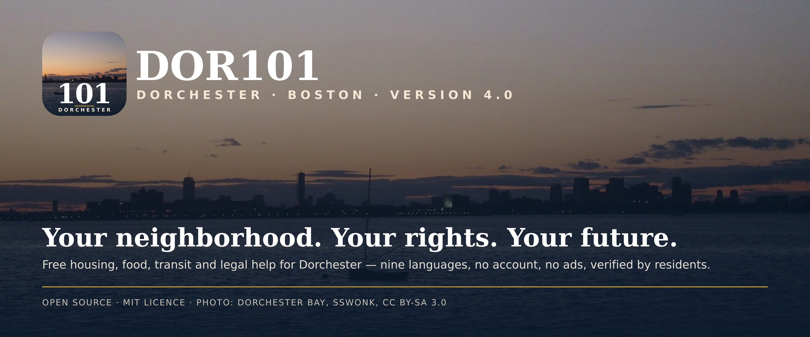
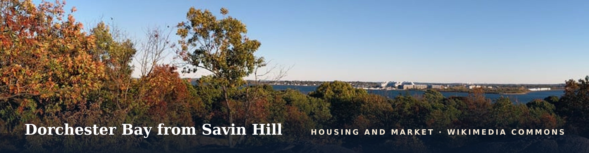
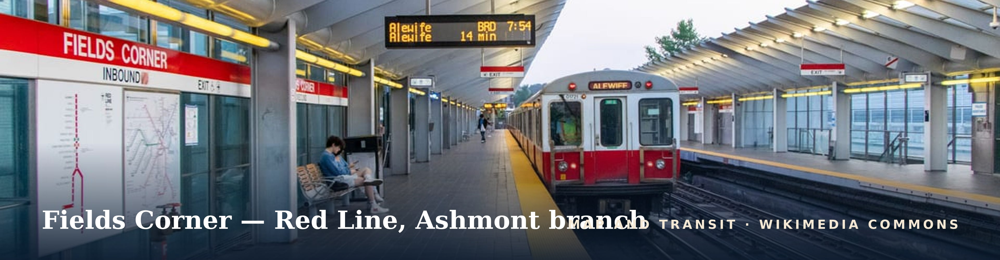
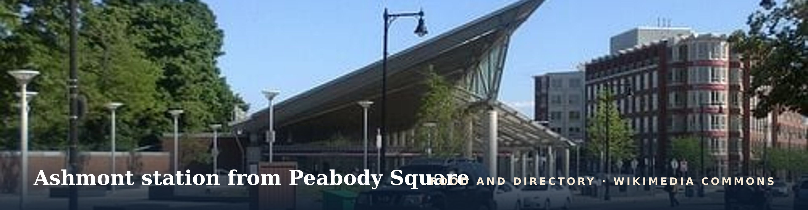
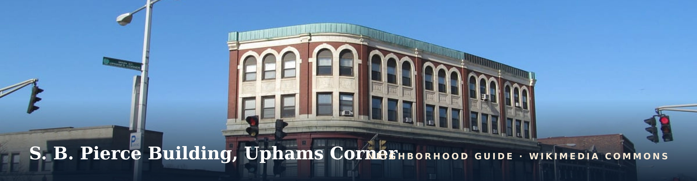

<p align="center">
  
</p>

<h1 align="center">DOR101 — Dorchester 101</h1>

<p align="center"><strong>Your neighborhood. Your rights. Your future.</strong></p>

<p align="center">
  <a href="https://github.com/Nikoxkx/Dorchester-101/releases/latest"></a>
  <a href="LICENSE"></a>
  
  
  
</p>

DOR101 is a free, open-source guide to help in **Dorchester, Boston**: housing you can afford, food when money runs short, the bus or train that gets you there, and the legal rights that protect you as a tenant. Every number on the site is traced to the public authority that published it, every listing shows the date a resident last checked it, and the whole thing works in nine languages with **no account, no ads and no data collection**.

It ships as a website (installable as a PWA and usable offline) and as a Windows desktop application.

---

## Table of contents

1. [What's new in 4.0](#whats-new-in-40)
2. [Download & install](#download--install)
3. [Features](#features)
4. [Languages & accessibility](#languages--accessibility)
5. [Data sources](#data-sources)
6. [Technology](#technology)
7. [Architecture](#architecture)
8. [For developers](#for-developers)
9. [Configuration](#configuration)
10. [Testing & quality](#testing--quality)
11. [Privacy & security](#privacy--security)
12. [Contributing](#contributing)
13. [Image credits & licence](#image-credits--licence)

---

## What's new in 4.0

| Area | Change |
|------|--------|
| **Seven colour palettes** | Harbor (default), **Black & white**, Forest, Brick, Slate, Sand and Violet. Each has a light and a dark version, keeps the same contrast ratios, and is applied to the whole site — cards, buttons, charts, map controls — not just the header. Settings → Appearance. |
| **Door-to-door transit directions** | Every place on the map has a **Bus / train route** button. It asks the browser for your location once and opens Google Maps with the full route from where you stand, using live MBTA times. Apple Maps and walking routes are one tap away. |
| **Photographic brand** | The logo, favicon, PWA icons and the link-preview card are built from a real photograph of the Boston skyline seen across Dorchester Bay (Wikimedia Commons, CC BY-SA 3.0), not a generated illustration. |
| **Shareable & indexable** | A 1200×630 Open Graph / Twitter card (`/og.png`), `robots.txt`, `sitemap.xml`, canonical URLs and schema.org `WebSite` + `Organization` JSON-LD on every page. Pasting a link into iMessage, WhatsApp, Slack or X shows the logo, description and a preview. |
| **Clean dashboard map** | The dashboard map preview is now imagery only. Symbols and route lines belong to the full map page, where they are drawn correctly and cannot overflow neighbouring content. |
| **Zero-warning codebase** | Every `react-hooks/set-state-in-effect` and `exhaustive-deps` warning was fixed properly (lazy initialisers, `useSyncExternalStore`, render-time comparisons) rather than suppressed. `npm run lint` reports 0 errors, 0 warnings. |
| Also | Glass/transparent surface toggle, per-project site imagery with "no render published" fallbacks, neighbourhood photographs, housing primer, source badges with hover previews, PlaceSheet redesign, stronger settings contrast, console-error clean-up. |

---

## Download & install

### Web / PWA

Open the deployed site, then use your browser's **Install** / **Add to Home Screen** option. DOR101 registers a service worker that pre-caches the app shell, the directory data, source badges and icons, so the directory, map places, FAQ and hotlines keep working with no signal. Live MBTA predictions and news naturally need a connection.

### Windows desktop

Download from [GitHub Releases](https://github.com/Nikoxkx/Dorchester-101/releases/latest):

| File | Use it when |
|------|-------------|
| `DOR101 Setup 4.0.0.exe` | You want Start Menu and Desktop shortcuts. |
| `DOR101-Portable-4.0.0.exe` | You are on a library or shelter computer, or a USB stick — no install, no admin rights. |

> Windows SmartScreen may warn that the build is unsigned. Choose **More info → Run anyway**. No database, API key or configuration is required.

---

## Features

<p align="center"></p>

### Housing

* **Affordable housing directory** — income-restricted listings with an AMI calculator that tells you which bracket (30 / 50 / 60 / 80 / 100 %) your household lands in and what you can actually apply for.
* **Housing projects** — every BPDA-approved and under-construction development in Dorchester with unit counts, income breakdown, developer, approval date, official filing links and, where the developer published one, the site render. Where no render exists the card says so instead of guessing.
* **Housing primer** — Section 8, BHA public housing, Metrolist, inclusionary units, lotteries and the Massachusetts right-to-counsel pilot, in plain language, with links to the primary sources.
* **Market trends** — Zillow ZORI rents, Redfin sale prices, HUD Fair Market Rents and the 2025 Boston AMI table, with charts by sub-neighbourhood.
* **Financial tools** — rent-burden calculator, eligibility screener, document checklist.

<p align="center"></p>

### Map & transit

* Satellite, street and hybrid views (Esri World Imagery and OpenStreetMap).
* Six resource layers — housing, food, health, legal, education, community — with category pins and a **PlaceSheet** panel that never overlaps other map controls.
* **Live MBTA departures** for the Red Line (Ashmont and Braintree branches), Fairmount Line and the 15, 16, 17, 18, 19, 21, 22, 23, 28 and 210 bus routes, from the MBTA V3 API.
* Route geometry from MBTA shapes with an offline fallback path for each line.
* Transit, walking and Apple Maps directions from your location.

<p align="center"></p>

### Food, health, legal & community

* **Food** — pantries, hot meals, community fridges, mobile markets, with hours, languages spoken, whether ID is needed, and a SNAP / WIC / HIP eligibility guide.
* **Resource directory** — organisations by category, each with a *last verified* date, a source badge and a "report a problem" button that pre-fills a GitHub issue.
* **Emergency hotlines** pinned to the dashboard: 911, 311, 211, the BHA emergency line, Mass 2-1-1 shelter, Safelink and the 988 crisis line.
* **News** — live feed from the Dorchester Reporter, WBUR, GBH and the Globe's Dorchester coverage, filterable by topic.
* **FAQ** — questions residents actually asked, answered with citations.

<p align="center"></p>

### Neighbourhood guide

Profiles of Fields Corner, Savin Hill, Uphams Corner, Ashmont, Codman Square, Grove Hall, Four Corners, Neponset, Lower Mills, Bowdoin–Geneva, Meeting House Hill, Columbia Point and Harbor Point — history, transit, landmarks, and a photograph from Wikimedia Commons that appears only while that profile is open.

### Personalisation & settings

* Seven colour palettes × light / dark / system.
* Solid or glass (translucent) surfaces.
* Four text sizes, dyslexia-friendly font, reduced motion, high contrast.
* Read-aloud for any page using the browser's speech engine, in the language you selected.
* Language, palette and every other preference is stored on the device only.

---

## Languages & accessibility

| | Language | Code | Notes |
|-|----------|------|-------|
| 🇺🇸 | English | `en` | source strings |
| 🇲🇽 | Spanish | `es` | |
| 🇭🇹 | Haitian Creole | `ht` | |
| 🇧🇷 | Portuguese | `pt` | |
| 🇻🇳 | Vietnamese | `vi` | |
| 🇨🇳 | Chinese (Simplified) | `zh` | |
| 🇸🇦 | Arabic | `ar` | full right-to-left layout |
| 🇸🇴 | Somali | `so` | |
| 🇨🇻 | Cape Verdean Creole | `kea` | |

The nine languages are the languages Boston Public Schools reports as most spoken in Dorchester homes. A Vitest suite fails the build if any locale is missing a key that English has, so a feature cannot ship half-translated.

Accessibility: WCAG 2.2 AA contrast in every palette, full keyboard navigation, skip links, a polite live region for status changes, `prefers-reduced-motion` and `prefers-contrast` honoured, focus-visible rings throughout, semantic landmarks on every page, and a print stylesheet for the directory and hotlines.

---

## Data sources

Every figure carries a badge naming its source; hover or tap the badge to see what the source is and when the data was pulled. Nothing is sourced from scraped commercial listings, social media or anonymous forums.

| Source | What DOR101 uses it for |
|--------|-------------------------|
| **U.S. Census Bureau — ACS 5-year** | Population, income, rent burden, languages spoken |
| **HUD User** | Fair Market Rents, income limits |
| **MBTA V3 API** | Live predictions, alerts, stop and shape geometry |
| **Boston Housing Authority** | Public housing, Section 8, waitlist status |
| **Boston Planning & Development Agency** | Development projects, Article 80 filings, IDP units |
| **Boston.gov / Mayor's Office of Housing** | Metrolist, AMI table, Office of Housing Stability programs |
| **Mass.gov / DHCD / DTA** | RAFT, HomeBASE, SNAP, WIC, HIP |
| **Greater Boston Food Bank** | Pantry network and hours |
| **MassLegalHelp / Greater Boston Legal Services** | Tenant rights, eviction process, right-to-counsel |
| **OpenStreetMap contributors** | Street tiles and geocoding |
| **Esri World Imagery** | Satellite tiles |
| **Wikimedia Commons** | Photographs (each with its author and licence in `public/IMAGE-CREDITS.md`) |
| **Dorchester Reporter, WBUR, GBH, Boston Globe** | News feed (headline, link and excerpt only) |

---

## Technology

<p align="center">
  <a href="https://nextjs.org"></a>&nbsp;&nbsp;&nbsp;
  <a href="https://react.dev"></a>&nbsp;&nbsp;&nbsp;
  <a href="https://www.typescriptlang.org"></a>&nbsp;&nbsp;&nbsp;
  <a href="https://tailwindcss.com"></a>&nbsp;&nbsp;&nbsp;
  <a href="https://www.electronjs.org"></a>&nbsp;&nbsp;&nbsp;
  <a href="https://nodejs.org"></a>&nbsp;&nbsp;&nbsp;
  <a href="https://vitest.dev"></a>&nbsp;&nbsp;&nbsp;
  <a href="https://playwright.dev"></a>&nbsp;&nbsp;&nbsp;
  <a href="https://eslint.org"></a>&nbsp;&nbsp;&nbsp;
  <a href="https://www.postgresql.org"></a>&nbsp;&nbsp;&nbsp;
  <a href="https://github.com/features/actions"></a>&nbsp;&nbsp;&nbsp;
  <a href="https://www.python.org"></a>
</p>
<p align="center">
  <a href="https://leafletjs.com"></a>&nbsp;&nbsp;&nbsp;&nbsp;
  <a href="https://www.openstreetmap.org"></a>&nbsp;&nbsp;&nbsp;&nbsp;
  <a href="https://www.mbta.com/developers/v3-api"></a>&nbsp;&nbsp;&nbsp;&nbsp;
  <a href="https://recharts.org"></a>&nbsp;&nbsp;&nbsp;&nbsp;
  <a href="https://zustand-demo.pmnd.rs"></a>&nbsp;&nbsp;&nbsp;&nbsp;
  <a href="https://lucide.dev"></a>&nbsp;&nbsp;&nbsp;&nbsp;
  <a href="https://orm.drizzle.team"></a>&nbsp;&nbsp;&nbsp;&nbsp;
  <a href="https://sharp.pixelplumbing.com"></a>
</p>

| Layer | Choice | Why |
|-------|--------|-----|
| Framework | **Next.js 16**, App Router, React 19 | Server components for the data-heavy pages, route handlers for the MBTA / news proxies, `metadata` API for SEO. |
| Language | **TypeScript 5**, `strict` | Every dataset is typed; a wrong AMI column fails to compile. |
| Styling | **Tailwind CSS 4** + CSS custom properties | Palettes, surfaces and dark mode are token swaps on `<html>`; components never hard-code a colour. |
| State | **Zustand** with `persist` | Preferences survive reloads; nothing leaves the device. |
| Maps | **Leaflet 1.9** / **react-leaflet 5** | Esri World Imagery + OpenStreetMap tiles, MBTA shape polylines, custom SVG pins. |
| Charts | **Recharts** | Market and demographic charts that inherit the palette. |
| Icons | **Lucide** | Consistent stroke icons; source badges are hand-drawn SVGs in `public/sources/`. |
| i18n | Hand-rolled typed dictionaries | 9 locales, `TranslationKey` union, parity test, `scripts/i18n-add.py` helper. |
| Offline | Service worker (`public/sw.js`) | Versioned cache of shell, data, badges and icons; stale-while-revalidate for the rest. |
| Desktop | **Electron 33** + electron-builder | NSIS installer and portable exe. |
| Images | **sharp** | Generates the logo set, PWA icons and Open Graph card from the source photograph. |
| Database | **PostgreSQL** + **Drizzle ORM** (optional) | Only for deployments that want to edit listings through an admin UI; the default build is fully static JSON. |
| Testing | **Vitest**, **Playwright**, **ESLint 9** | Unit + i18n parity, end-to-end, lint at 0 warnings. |
| CI | **GitHub Actions** | typecheck → lint → test → build on every push. |

---

## Architecture

```
Dorchester-101/
├── .github/workflows/          CI: typecheck, lint, test, build
├── docs/media/                 4K README imagery (generated by sharp from Commons photos)
├── electron/                   main process, preload, builder config
├── e2e/                        Playwright specs
├── public/
│   ├── icons/                  PWA icons (photographic logo, 192–1024 px, maskable)
│   ├── img/                    neighbourhood & project photos (see IMAGE-CREDITS.md)
│   ├── sources/                one SVG badge per data source
│   ├── logo.png, og.png        brand mark and link-preview card
│   ├── manifest.json, sw.js    PWA manifest and versioned service worker
│   └── IMAGE-CREDITS.md        author + licence for every photograph
├── scripts/
│   └── i18n-add.py             add a key to all nine locales at once
└── src/
    ├── app/                    routes (App Router)
    │   ├── api/                mbta/, news/, og/ route handlers (server-side proxies)
    │   ├── housing/ projects/ market/ map/ food/ resources/ news/ faq/ about/ settings/
    │   ├── layout.tsx          metadata, JSON-LD, providers
    │   ├── robots.ts sitemap.ts
    │   └── globals.css         design tokens, palettes, surfaces, print
    ├── components/
    │   ├── layout/             Sidebar, Header, ProjectNote, footer
    │   ├── map/                DorchesterMap, MapCanvas, MapPreview, PlaceSheet, pins
    │   ├── housing/ projects/ dashboard/ sources/ search/ a11y/ pwa/ providers/ ui/
    ├── data/                   typed datasets: resources, transit, projects, neighborhoods, sources
    ├── hooks/                  useResolvedPrefs, useOnline, useReadAloud, useMediaPreferences…
    ├── i18n/                   en.ts (source of truth) + locales/*.ts + config
    ├── lib/                    geo (haversine, directions URLs), mbta client, site constants
    ├── stores/appStore.ts      Zustand: language, theme, palette, surface, font, a11y
    └── db/                     Drizzle schema (optional)
```

**Rendering model.** Pages are server components that import typed JSON datasets; only interactive islands (map, search, settings, charts) are client components. The MBTA and news feeds are fetched by route handlers on the server so the browser never talks to a third party directly and API keys stay server-side.

**Theming model.** `DorchesterProviders` writes `data-theme`, `data-palette`, `data-surface`, `data-font-size` and `dir` onto `<html>` from the store. `globals.css` defines the tokens (`--color-bg-*`, `--color-text-*`, `--color-accent-*`, `--color-border`, `--color-on-accent`) once per palette × light/dark. Components reference tokens only, which is what makes a whole-site palette a 40-line CSS block instead of a refactor.

**Offline model.** `sw.js` has a `VERSION` constant; bumping it invalidates every cache on the next visit. Shell and data are cache-first, API routes are network-only with a friendly offline message, everything else is stale-while-revalidate.

---

## For developers

### Requirements

* Node.js 20 or later (22 recommended)
* npm 10+
* Python 3 (only for `scripts/i18n-add.py`)
* PostgreSQL 15+ (optional, only if you enable the database)

### Quick start

```bash
git clone https://github.com/Nikoxkx/Dorchester-101.git
cd Dorchester-101
npm ci
npm run dev          # http://localhost:3000
```

### Commands

| Command | What it does |
|---------|--------------|
| `npm run dev` | Next.js dev server with Turbopack |
| `npm run build` | Production build (also validates metadata, sitemap, robots) |
| `npm run start` | Serve the production build |
| `npm run typecheck` | `tsc --noEmit` |
| `npm run lint` | ESLint 9 flat config — must be 0 errors / 0 warnings |
| `npm run test` | Vitest unit tests incl. i18n parity |
| `npm run test:e2e` | Playwright end-to-end |
| `npm run electron:dev` | Run the desktop shell against the dev server |
| `npm run build:exe` | Windows installer (`dist-electron/`) |
| `npm run build:portable` | Windows portable exe |

### Adding a translated string

```bash
cat > key.json <<'EOF'
{ "settings.palette.forest": { "en": "Forest", "es": "Bosque", "ht": "Forè", "pt": "Floresta",
  "vi": "Rừng", "zh": "森林", "ar": "غابة", "so": "Kayn", "kea": "Floresta" } }
EOF
python3 scripts/i18n-add.py --from key.json --apply
```

The key becomes part of the `TranslationKey` union immediately, so `t('settings.palette.forest')` type-checks and the parity test passes.

### Regenerating brand assets

The logo set and Open Graph card are generated from `public/img/dorchester-bay-sunset.jpg` with sharp. The recipes live in the git history of `public/icons/` and `public/og.png`; rerun them whenever the source photograph or wordmark changes, then bump `VERSION` in `public/sw.js`.

---

## Configuration

All variables are optional; the site runs with none of them.

| Variable | Default | Purpose |
|----------|---------|---------|
| `NEXT_PUBLIC_SITE_URL` | `http://localhost:3000` | Canonical origin for `metadataBase`, sitemap, robots, JSON-LD and the OG image URL. **Set this in production** or social previews will point at localhost. |
| `NEXT_PUBLIC_APP_VERSION` | `4.0.0` | Shown in About and the footer. |
| `MBTA_API_KEY` | — | Raises the MBTA rate limit from 20 to 1000 req/min. Server-side only. |
| `DATABASE_URL` | — | Enables the Drizzle/PostgreSQL admin path. |

---

## Testing & quality

* **Type safety** — TypeScript `strict`; every dataset and translation key is typed.
* **Lint** — ESLint 9 with `next/core-web-vitals` and `react-hooks` (including the React 19 `set-state-in-effect` rule). Zero warnings.
* **Unit** — Vitest (`src/__tests__/`): API route validation, app store, opening-hours logic, transit data integrity, i18n parity across all nine locales.
* **E2E** — Playwright (`e2e/app.spec.ts`) smoke-tests the main routes.
* **Data review** — every resource carries a *last verified* date shown in the UI; `lastReviewedOn()` feeds the sitemap so crawlers see real change dates.

---

## Privacy & security

* No accounts, cookies, analytics, fingerprinting, or third-party scripts.
* Preferences live in `localStorage` on the device and can be wiped from Settings → Reset.
* The **Bus / train route** button asks for your location only when you tap it, uses it once to build a Google or Apple Maps link, and never stores or transmits it.
* Third-party data (MBTA, news) is fetched by the server, so those providers never see the visitor's IP or browser.
* Content Security Policy, `Referrer-Policy: strict-origin-when-cross-origin` and `Permissions-Policy` headers are set in `next.config.ts`.
* The Electron build disables `nodeIntegration`, enables `contextIsolation` and loads only the bundled app.

---

## Contributing

1. **Verify first.** Every new listing, figure or claim needs a link to the authority that published it and a `lastVerified` date. Nothing from social media, ads or anonymous forums.
2. **Translate everything.** Use `scripts/i18n-add.py`; the build fails on a missing key.
3. **Use tokens, not colours.** Components reference `var(--color-…)`; never a hex value. Test your change in Black & white and at least one other palette, light and dark.
4. **No overlap.** Popups, sheets and toasts must not cover map controls, navigation or each other. Animations respect `prefers-reduced-motion`.
5. **Photos** come from Wikimedia Commons or an official publisher, with author and licence added to `public/IMAGE-CREDITS.md`. If no photo exists for a place, say so in the UI rather than substituting a look-alike.
6. Run `npm run typecheck && npm run lint && npm run test && npm run build` before opening a pull request.

---

## Image credits & licence

Photographs are from Wikimedia Commons and are credited individually — author, licence and source URL — in [`public/IMAGE-CREDITS.md`](public/IMAGE-CREDITS.md). The hero image and logo use *Boston skyline from Dorchester Bay* by Sswonk, CC BY-SA 3.0. Technology logos in this README are the trademarks of their respective projects and are used for identification only. Source badges in `public/sources/` are original icons drawn for DOR101 and do not reproduce any agency's trademark.

Code is released under the **MIT licence** — see [LICENSE](LICENSE).

---

## Acknowledgments

DOR101 exists because public agencies and community organisations publish their data openly: the Boston Housing Authority, the BPDA, the Mayor's Office of Housing, the Office of Housing Stability, the MBTA, HUD, the U.S. Census Bureau, the Greater Boston Food Bank, Project Bread, Greater Boston Legal Services, MassLegalHelp, City Life / Vida Urbana, CSNDC, DBEDC, VietAID, ABCD, the Dorchester Reporter, WBUR and GBH — and the Wikimedia Commons photographers who documented the neighbourhood.

<p align="center"><strong>DOR101 — Dorchester 101</strong><br/><em>Your neighborhood. Your rights. Your future.</em></p>
